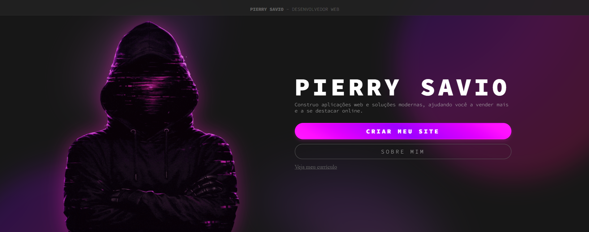

# Pierry Savio - Portfólio

🔗 **Acesse o site:** [https://pierry.netlify.app/](https://pierry.netlify.app/)

## 📋 Sobre o projeto

Este é o meu portfólio profissional como desenvolvedor web freelancer, criado para apresentar quem eu sou, meus projetos, habilidades e formação, além de facilitar o contato com potenciais clientes.

## ✨ Funcionalidades

- **Página inicial** com apresentação e chamadas para ação (criar site / saiba mais)
    - Hero page moderna.
- **Seção Sobre Mim** contando minha trajetória com a programação
    - Scroll driven animations.
    - Um pouco sobre minha trajetória como dev.
- **Página de Projetos** com os trabalhos que já desenvolvi
    - Carrossel de projetos dinâmico e responsivo.
- **Página de Habilidades** com as tecnologias que utilizo
    - Carrosséis separados por áreas.
- **Página de Educação** com minha formação
    - Cards expansíveis.
    - Cursos técnicos e formações.
- **Página de Contato** para orçamentos e propostas
    - Formulário com integração com banco de dados Firebase
- **Navegação responsiva**, com menu adaptado para mobile e desktop
    - Desktop, mobile e tablet.
- **Transições de página suaves** usando a View Transitions API
    - Transições suaves entre páginas (a API ainda está inconsistente)

## 🛠️ Tecnologias utilizadas

- 🟠 HTML5
- 🔵 CSS3
- 🟣 SASS
- 🟡 JavaScript
- 🌠 View Transitions API
- 🔥 Firebase

## 📬 Contato

- Site: [https://pierry.netlify.app/](https://pierry.netlify.app/)
- Página de contato: acesse o site e clique em **Contato**

---

Feito por **Pierry Savio**
